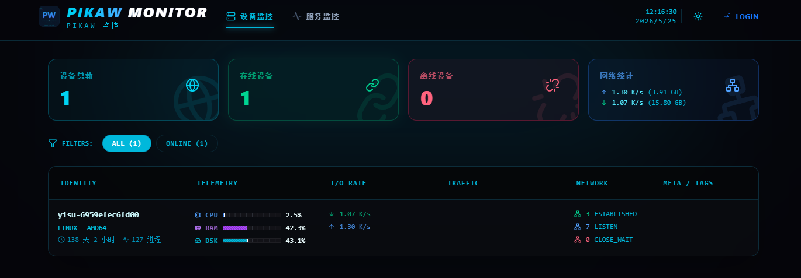
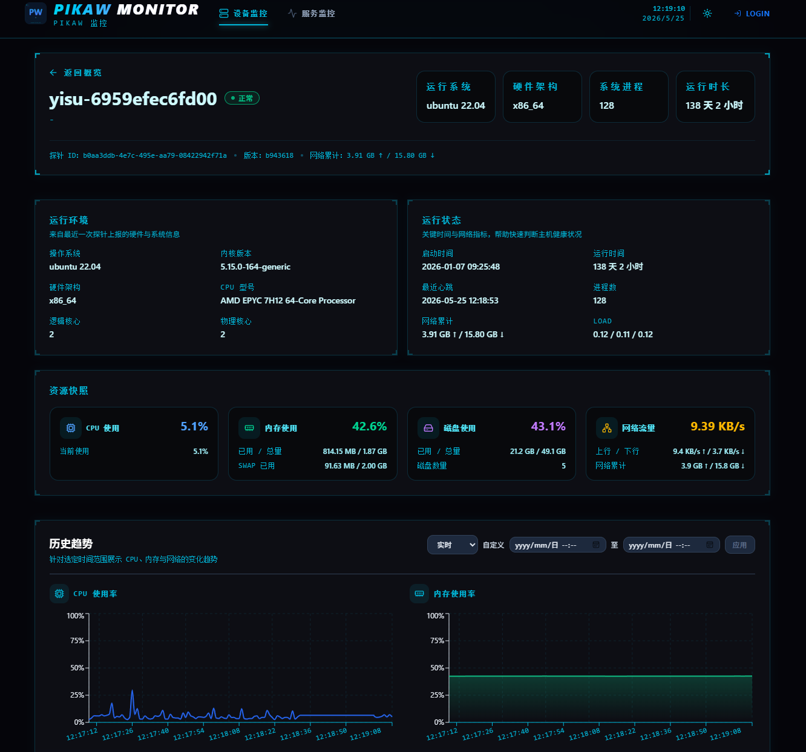
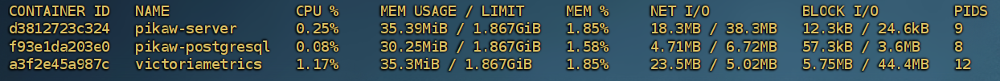
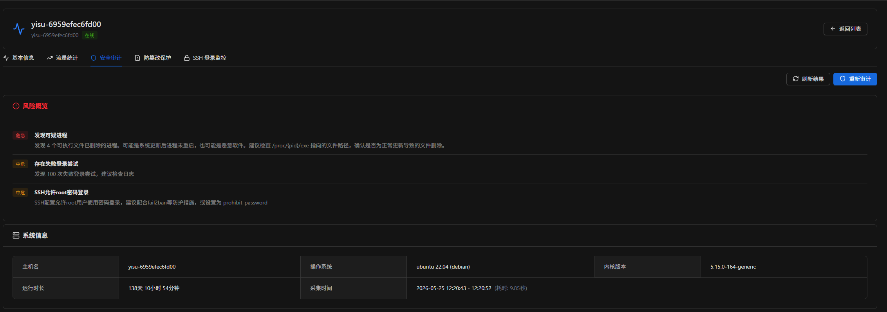
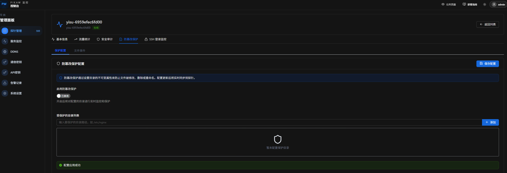
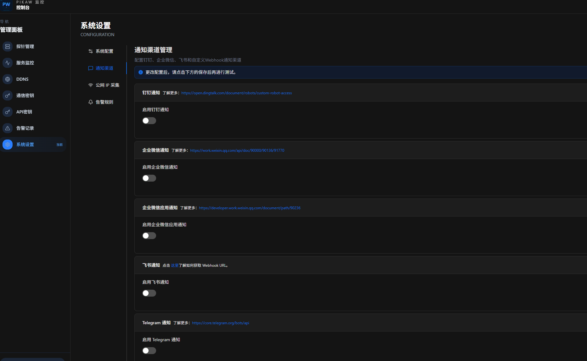

# PikaW 探针监控系统

<div align="center">

一个基于 Go + PostgreSQL/SQLite + VictoriaMetrics 的实时探针监控系统

[快速开始](#快速开始) • [截图](#截图) • [功能特性](#功能特性) • [文档](#文档)

</div>

## 简介

PikaW 是一个轻量级的探针监控系统，支持实时数据采集、存储和查询。系统采用 WebSocket 进行探针与服务端的通信，使用 VictoriaMetrics 存储时序指标数据，支持 PostgreSQL 和 SQLite 两种数据库方案。除了基础监控功能外，还提供 Linux 应急响应和安全基线检查能力，帮助快速发现和分析系统安全风险。


## 功能特性

- **📊 实时性能监控**：CPU、内存、磁盘、网络、GPU、温度等系统资源监控
- **🔍 服务监控**：HTTP/HTTPS、TCP 端口、ICMP/Ping 监控，支持证书到期检测
- **🛡️ 防篡改保护**：文件实时监控、属性巡检、事件告警
- **🔒 安全审计**：资产清单收集、安全风险分析、历史审计记录
- **🔐 多种认证**：Basic Auth、OIDC、GitHub OAuth
- **📦 轻量部署**：Docker Compose 一键部署，资源占用低

详细功能说明请参考 [功能特性文档](docs/features.md)。

## 截图








## 快速开始

### SQLite 版本

```bash
# 下载配置文件
curl -O https://raw.githubusercontent.com/wybroot/pikaw/master/docker-compose.sqlite.yml
curl -o config.yaml https://raw.githubusercontent.com/wybroot/pikaw/master/config.sqlite.yaml

# 修改配置（重要：修改 JWT Secret 和管理员密码）
# 编辑 config.yaml

# 启动服务
docker-compose -f docker-compose.sqlite.yml up -d

# 访问 http://localhost:8080
# 默认账户 admin / admin123
```

详细文档：[SQLite 版本部署指南](docs/deployment-sqlite.md)

### PostgreSQL 版本

```bash
# 下载配置文件
curl -O https://raw.githubusercontent.com/wybroot/pikaw/master/docker-compose.postgresql.yml
curl -o config.yaml https://raw.githubusercontent.com/wybroot/pikaw/master/config.postgresql.yaml

# 修改配置（重要：修改数据库密码、JWT Secret 和管理员密码）
# 编辑 config.yaml

# 启动服务
docker-compose -f docker-compose.postgresql.yml up -d

# 访问 http://localhost:8080
# 默认账户 admin / admin123
```

详细文档：[PostgreSQL 版本部署指南](docs/deployment-postgresql.md)

## 文档

- [功能特性](docs/features.md)
- [SQLite 版本部署指南](docs/deployment-sqlite.md)
- [PostgreSQL 版本部署指南](docs/deployment-postgresql.md)
- [通用配置说明](docs/common-config.md)

## 环境要求

- Docker 20.10+
- Docker Compose 1.29+

基于pika监控二开，原项目地址https://github.com/dushixiang/pika.git